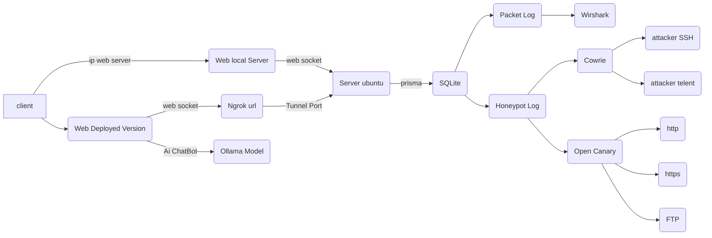

# Table of Contents
* [Raspberry Pi Setup](/docs/raspberry_pi_setup.md)
* [Get Started](/docs/Get_Started.md)
### Cowrie
* [Cowrie Installation](/docs/Cowrie.md)
* [Cowrie Plugin Login](/docs/Cowrie_Plugin[1].md)
* [Cowrie Plugin Fake file system](/docs/Cowrie_Plugin[2].md)
* [Cowrie Plugin Create User home directory](/docs/Cowrie_Plugin[2].md)
### OpenCanary
* [OpenCanary Installation](/docs/OpenCanary.md)
* [OpenCanary Plugin Http/Https Mockup](/docs/Opencanary_Plugin[1].md)
### dashboard-honeypot
* [Dashborad Frontend](/docs/Dashboard/Dashboard.md)
* [Dashborad Backend](/docs/Dashboard/Backend.md)

# Graph ระบบโดยรวม

