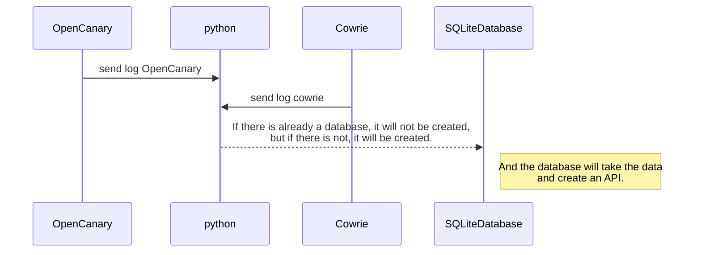

### **คู่มือการใช้งาน: Backend**

คู่มือนี้จะอธิบายขั้นตอนการตั้งค่าและใช้งาน Backend ซึ่งมีหน้าที่หลักในการแปลง Log จากแต่ละ Service แล้วนำไปเก็บไว้ในฐานข้อมูล **SQLiteDB** รวมถึงการส่งข้อมูลผ่าน **WebSocket** ไปยังหน้า Dashboard



----------

###  **ส่วนที่ 1: การตั้งค่าเริ่มต้น**

เริ่มจากการติดตั้ง Library ที่จำเป็นสำหรับโปรเจกต์:

1.  ไปที่ Path ของโปรเจกต์: `cd /server/socket`
    
2.  ทำการติดตั้งแพ็กเกจที่จำเป็นสำหรับ Node.js:
    

    
    ```
    npm init -y
    npm install express cors morgan bcryptjs jsonwebtoken prisma socket.io dotenv nodemon sqlite3
    npm install yup
    ```
    
    _หมายเหตุ_: คำสั่ง `npm install` ที่ซ้ำกันในเอกสารต้นฉบับได้ถูกรวมไว้ในคำสั่งเดียวเพื่อให้ง่ายต่อการติดตั้ง
    
3.  ติดตั้ง **Prisma** ซึ่งเป็น ORM (Object-Relational Mapping) ที่ช่วยให้การจัดการฐานข้อมูลง่ายขึ้น:
    

    
    ```
    npm install prisma
    npm install @prisma/client
    ```
    

----------

###  **ส่วนที่ 2: การตั้งค่าฐานข้อมูล**

หากคุณต้องการใช้ฐานข้อมูลประเภทอื่นนอกเหนือจาก SQLite สามารถตั้งค่าได้ดังนี้:

-   **MySQL**: `npx prisma init --datasource-provider mysql`
    
-   **PostgreSQL**: `npx prisma init --datasource-provider postgresql`
    
-   **SQLite**: `npx prisma init --datasource-provider sqlite`
    

หลังจากตั้งค่าประเภทฐานข้อมูลแล้ว ให้ไปที่ไฟล์ `.env` ที่ path `/server/socket/.env` และตั้งค่าตามตัวอย่าง:

-   **JWT_SEC**: ใช้สำหรับ Sign Token สามารถเปลี่ยนเป็นรหัสลับของคุณเองได้
    
    ```
    JWT_SEC="your secret key"
    
    ```
    
-   **DATABASE_URL**: ระบุ Path ที่เก็บไฟล์ฐานข้อมูล
    
    ```
    DATABASE_URL="file:C:\your path\HeneyPot.db"
    
    ```
    

**การจัดการ Schema และฐานข้อมูล:**

-   ถ้าคุณมีฐานข้อมูลอยู่แล้วและต้องการดึง Schema มาใช้กับ Prisma:
    
    ```
    npx prisma db pull
    npx prisma generate
    ```
    
-   หากมีการแก้ไข Schema (เช่น เพิ่มหรือลบตาราง) ให้ใช้คำสั่งต่อไปนี้:
    
    
    ```
    npx prisma db push
    ```
    

**คำแนะนำ**: **ไม่แนะนำ** ให้ใช้คำสั่ง `npx prisma migrate dev` ในการสร้างฐานข้อมูล เนื่องจากอาจทำให้เกิดข้อผิดพลาดได้ง่าย

----------

###  **ส่วนที่ 3: การประมวลผล Log ด้วย Python**

ในส่วนนี้เป็นการรันสคริปต์ Python เพื่อแปลง Log และนำข้อมูลเข้าสู่ฐานข้อมูล:

1.  ไปที่ path: `/server/plugin/convertData/`
    
2.  เปิดไฟล์ `Honeypot_Log_Processor.py` และ **แก้ไข Path** ของ Log แต่ละ Service ให้ตรงกับที่อยู่จริงในเครื่องของคุณ
    
3.  รันสคริปต์ด้วยคำสั่ง:
    
    
    ```
    sudo python3 Honeypot_Log_Processor.py
    ```
    
    -   โปรแกรมจะทำการสร้างไฟล์ `HeneyPot.db` ขึ้นมา และจะคอยตรวจสอบ Log ใหม่เพื่อ **Insert ข้อมูลลงในฐานข้อมูลโดยอัตโนมัติ**