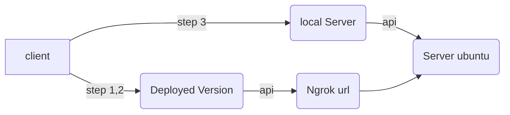

## **คู่มือการใช้งาน: Smart Tiny Honeypot**

ยินดีต้อนรับสู่คู่มือการใช้งาน Smart Tiny Honeypot! คู่มือนี้จะช่วยให้คุณเริ่มต้นใช้งานโปรเจกต์ได้อย่างง่ายดาย ไม่ว่าจะเป็นการเข้าถึงหน้าเว็บที่ Deploy ไว้ หรือการรันโปรเจกต์บนเครื่องของคุณเอง


  
### **ส่วนที่ 1: การเข้าถึงเว็บแอปพลิเคชัน (Deployed Version)**

หากคุณต้องการใช้งานเว็บแอปพลิเคชันที่ติดตั้งบนเซิร์ฟเวอร์แล้ว สามารถทำตามขั้นตอนเหล่านี้ได้เลย:

1.  ไปที่ลิงก์: **[https://smart-tiny-honeypot.netlify.app/](https://smart-tiny-honeypot.netlify.app/)**
    
2.  เมื่อเข้าไปที่หน้า **Login** ให้คลิกที่ **"Add Url"** เพื่อเพิ่ม URL ที่จะใช้
    
3.  **สำคัญ**: ก่อนใช้งาน คุณต้องใช้ **Ngrok URL** ที่มาจากเซิร์ฟเวอร์ที่คุณกำลังรันอยู่
    
4.  หากคุณมีบัญชีอยู่แล้ว ให้ **Login** ตามปกติ แต่ถ้ายังไม่มี ให้เลือก **Sign Up** เพื่อสร้างบัญชีใหม่
    
    -   **ข้อควรจำ**: หลังจากสมัครสมาชิก คุณจะยังไม่สามารถเข้าถึงข้อมูลของทั้ง 3 เซอร์วิสได้ทันที **ผู้ดูแลระบบ (Admin)** จะต้องทำการอนุมัติสิทธิ์ให้คุณก่อน
        
5.  เมื่อได้รับสิทธิ์แล้ว คุณจะสามารถเข้าถึงข้อมูลและใช้งานได้ตามปกติ

### **ส่วนที่ 2: การตั้งค่า Chatbot AI**

หากคุณต้องการรัน Chatbot AI ด้วยตัวเองบนเซิร์ฟเวอร์ มีขั้นตอนดังนี้:

1.  เปิด **Command Prompt (CMD)** หรือ **Terminal** บนเครื่องเซิร์ฟเวอร์ที่คุณจะใช้เปิด **Ollama**
    
2.  ตั้งค่าให้ Ollama สามารถรับการเชื่อมต่อจากภายนอกได้โดยใช้คำสั่ง:
    
    -   **Windows**:
        
        ```
        set OLLAMA_HOST=0.0.0.0
        
        ```
        ```
        set OLLAMA_ORIGINS=*
        ```
        
    -   **macOS/Linux**:
        
        ```
        export OLLAMA_HOST=0.0.0.0
        
        ```
        ```
        export OLLAMA_ORIGINS=*
        ```
        
3.  หลังจากตั้งค่าแล้ว ให้รันคำสั่งเพื่อเริ่มเซิร์ฟเวอร์ Ollama:
    
    ```
    ollama serve
    ```
  
### **ส่วนที่ 3: การรันเว็บไซต์บน Server ของคุณ**

สำหรับนักพัฒนาที่ต้องการรันหน้าเว็บแอปพลิเคชันบนเครื่องของคุณเอง สามารถทำตามขั้นตอนต่อไปนี้:

1.  เปิด Terminal หรือ CMD
    
2.  ไปที่ไดเรกทอรีของโปรเจกต์:
    
    ```
    cd .\DashboardV2
    
    ```
    
3.  ติดตั้ง dependencies ทั้งหมดที่จำเป็น:
    
    ```
    npm install
    
    ```
    
4.  เมื่อติดตั้งเสร็จแล้ว ให้รันโปรเจกต์ในโหมด development:
    
    ```
    npm run dev
    
    ```
    
    หลังจากนี้ เว็บไซต์จะเปิดขึ้นมาให้คุณใช้งานบนเครื่องของคุณเอง

  ### **ส่วนที่ 4: Library ที่ใช้ในการสร้าง**

ในส่วนนี้เป็นการรวบรวมคำสั่งสำหรับติดตั้ง Library ที่ใช้ในการพัฒนาโปรเจกต์นี้ เพื่อเป็นข้อมูลอ้างอิง:

-   สร้างโปรเจกต์ Vite:
    
    ```
    npm create vite@latest
    
    ```
    
-   ติดตั้ง dependencies ทั่วไป:
    
    ```
    npm install
    
    ```
    
-   ติดตั้งแพ็กเกจที่จำเป็นสำหรับโปรเจกต์:
    
    ```
    npm i axios
    npm i react-router-dom
    npm install @mui/material @emotion/react @emotion/styled
    npm install @mui/x-charts
    npm i antd
    npm install markdown-it
    npm install --save-dev @types/markdown-it
    npm install react@latest react-dom@latest
    npm install aos --save
    npm install --save-dev @types/aos
    npm add chart.js react-chartjs-2
    npm i recharts
    npm install socket.io-client
    npm install --save-dev @types/socket.io-client
    npm i react-syntax-highlighter
    npm i --save-dev @types/react-syntax-highlighter
    npm i qrcode.react
    ```